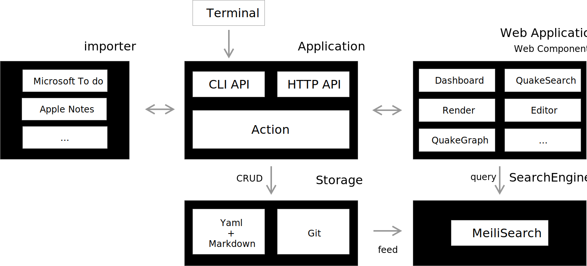

# Quake

[](https://github.com/phodal/quake/actions/workflows/build.yml)
[](https://coveralls.io/github/phodal/quake?branch=master)


> A meta knowledge management tool for geek.

Quake 是面向极客的知识管理元框架，它可以：

- 自由的文本内容管理。Todo 清单、文章管理、书评、笔记等。
- 构建知识网络体系。定制化 markdown 链接
- 抓住稍纵即逝的灵感。支持快速启动（CLI、TUI）与全局搜索
- 自由的呈现画布。DSL 与自由画板

文档示例：

1. [examples](./examples)

欢迎入群讨论：


## Introduction

Architecture:



Screenshots:


### Design principle

我使用了不同的工具来管理知识，Microsoft To Do 管理 idea、Phodit + [Phodal.com](https://www.phodal.com/) 发布文章、Apple Notes 记录笔记等等，知识被分散在各个工具中。不利于我进行洞见，寻找灵感，与此同时，还缺乏书写和记录的方式。

我需要一个新的工具来融合到我的知识体系里，它应该是：

- 开源的。可以自由扩展。
- 分布式 + 本地化的。可以离线使用，方便于出差旅途中使用。
- 版本化的。可以自由查看变更历史。
- 开放的。可以自由与其它工具组合。如 Vim、VSCode 等。
- 易于扩展。可以结合习惯用的工具。诸如于，基于 DSL 的编辑-发布分离的类 Web 模式，用于展示。如 MxGraph、Mermaid、Ledge Framework 等

### 愿景示例

1. 在项目中添加自定义的 Entry，进行对应的 TUI 管理。
2. 通过 Web Components，自定义 Entry 的展示。
3. 通过自定义的编辑器，或者 Web 编辑器来对内容编辑。

## Usage

1. init, `quake init`
2. config
 - `.quake.yml` to config quake
 -  edit `entries-define.yaml` to

## Terminal GUI

```
quake tui
```

### CLI

0. install

```bash
git clone https://github.com/phodal/quake && cd quake
cargo install --path .  # or: just install 
```

1. add entry by type

```bash
quake cmd -i "todo.add: time support"
```

2. edit entry by index

```bash
quake cmd -i "todo.edit(1)"
```

3. list entry by type

```bash
quake cmd -i "todo.list"
```

4. sync list

```bash
quake cmd -i "todo.sync"
```

5. show entry

```bash
quake cmd -i "todo.show(1)
```

### Web

1. setup search engine

```bash
brew install meilisearch
```

index

```
quake cmd -i "quake.feed"
```

2. run server

```
quake server
```

3. visit: [http://localhost:9999/](http://localhost:9999/)

### GUI (TBD)

TBD

License
---

markdown parser based on: [https://github.com/zoni/obsidian-export](https://github.com/zoni/obsidian-export) with Apache and MIT

@ 2021 This code is distributed under the MIT license. See `LICENSE` in this directory.
