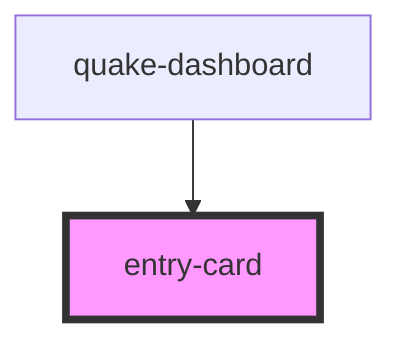

# entry-card

<!-- Auto Generated Below -->

## Properties

| Property   | Attribute   | Description | Type     | Default     |
| ---------- | ----------- | ----------- | -------- | ----------- |
| `fileProp` | `file-prop` |             | `string` | `undefined` |
| `item`     | `item`      |             | `any`    | `undefined` |
| `type`     | `type`      |             | `string` | `undefined` |

## Events

| Event         | Description | Type                  |
| ------------- | ----------- | --------------------- |
| `triggerEdit` |             | `CustomEvent<string>` |
| `triggerShow` |             | `CustomEvent<string>` |

## Dependencies

### Used by

 - [quake-dashboard](../quake-dashboard)

### Graph

----------------------------------------------

*Built with [StencilJS](https://stenciljs.com/)*
