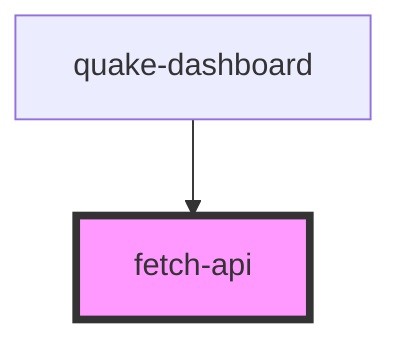

# fetch-api

<!-- Auto Generated Below -->

## Properties

| Property       | Attribute       | Description | Type       | Default |
| -------------- | --------------- | ----------- | ---------- | ------- |
| `entryType`    | --              |             | `string[]` | `[]`    |
| `searchEngine` | `search-engine` |             | `boolean`  | `false` |
| `type`         | `type`          |             | `string`   | `''`    |
| `url`          | `url`           |             | `string`   | `''`    |

## Events

| Event             | Description | Type               |
| ----------------- | ----------- | ------------------ |
| `fetchAllSuccess` |             | `CustomEvent<any>` |
| `fetchSuccess`    |             | `CustomEvent<any>` |

## Dependencies

### Used by

 - [quake-dashboard](../quake-dashboard)

### Graph

----------------------------------------------

*Built with [StencilJS](https://stenciljs.com/)*
