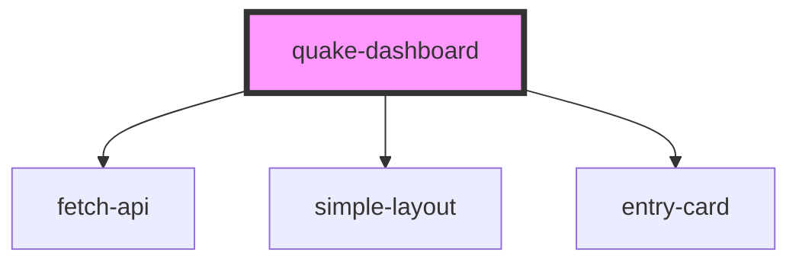

# my-component

<!-- Auto Generated Below -->

## Properties

| Property    | Attribute    | Description | Type     | Default |
| ----------- | ------------ | ----------- | -------- | ------- |
| `indexName` | `index-name` |             | `string` | `""`    |

## Events

| Event            | Description | Type                        |
| ---------------- | ----------- | --------------------------- |
| `dispatchAction` |             | `CustomEvent<ActionDefine>` |

## Dependencies

### Depends on

- [fetch-api](../fetch-api)
- [simple-layout](../simple-layout)
- [entry-card](../entry-card)

### Graph

----------------------------------------------

*Built with [StencilJS](https://stenciljs.com/)*
