# my-component

<!-- Auto Generated Below -->

## Properties

| Property    | Attribute    | Description | Type     | Default |
| ----------- | ------------ | ----------- | -------- | ------- |
| `indexName` | `index-name` |             | `string` | `""`    |

## Events

| Event            | Description | Type                        |
| ---------------- | ----------- | --------------------------- |
| `dispatchAction` |             | `CustomEvent<ActionDefine>` |

## Dependencies

### Depends on

- [fetch-api](../fetch-api)
- ion-toast
- ion-app
- ion-header
- ion-toolbar
- ion-item
- ion-chip
- ion-icon
- ion-label
- ion-input
- ion-button
- ion-content
- ion-grid
- ion-row
- ion-infinite-scroll
- ion-infinite-scroll-content
- [simple-layout](../simple-layout)
- ion-col
- ion-text
- ion-list
- ion-card
- ion-card-header
- ion-card-subtitle
- ion-card-title
- ion-card-content
- ion-badge

### Graph

```mermaid
graph TD;
  quake-dashboard --> fetch-api
  quake-dashboard --> ion-toast
  quake-dashboard --> ion-app
  quake-dashboard --> ion-header
  quake-dashboard --> ion-toolbar
  quake-dashboard --> ion-item
  quake-dashboard --> ion-chip
  quake-dashboard --> ion-icon
  quake-dashboard --> ion-label
  quake-dashboard --> ion-input
  quake-dashboard --> ion-button
  quake-dashboard --> ion-content
  quake-dashboard --> ion-grid
  quake-dashboard --> ion-row
  quake-dashboard --> ion-infinite-scroll
  quake-dashboard --> ion-infinite-scroll-content
  quake-dashboard --> simple-layout
  quake-dashboard --> ion-col
  quake-dashboard --> ion-text
  quake-dashboard --> ion-list
  quake-dashboard --> ion-card
  quake-dashboard --> ion-card-header
  quake-dashboard --> ion-card-subtitle
  quake-dashboard --> ion-card-title
  quake-dashboard --> ion-card-content
  quake-dashboard --> ion-badge
  ion-toast --> ion-icon
  ion-toast --> ion-ripple-effect
  ion-item --> ion-icon
  ion-item --> ion-ripple-effect
  ion-chip --> ion-ripple-effect
  ion-button --> ion-ripple-effect
  ion-infinite-scroll-content --> ion-spinner
  simple-layout --> ion-grid
  simple-layout --> ion-row
  simple-layout --> ion-col
  ion-card --> ion-ripple-effect
  style quake-dashboard fill:#f9f,stroke:#333,stroke-width:4px
```

----------------------------------------------

*Built with [StencilJS](https://stenciljs.com/)*
