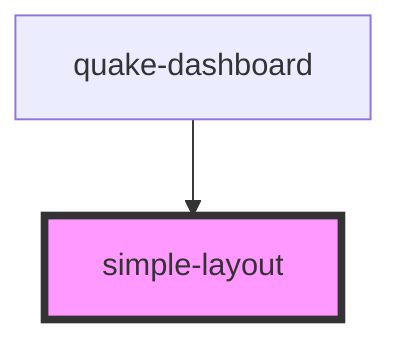

# simple-layout

<!-- Auto Generated Below -->

## Properties

| Property | Attribute | Description | Type     | Default     |
| -------- | --------- | ----------- | -------- | ----------- |
| `layout` | --        |             | `Layout` | `undefined` |

## Dependencies

### Used by

 - [quake-dashboard](../quake-dashboard)

### Graph

----------------------------------------------

*Built with [StencilJS](https://stenciljs.com/)*
