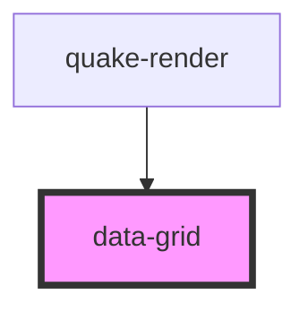

# data-grid

<!-- Auto Generated Below -->

## Properties

| Property | Attribute | Description | Type    | Default |
| -------- | --------- | ----------- | ------- | ------- |
| `data`   | --        |             | `Table` | `null`  |

## Dependencies

### Used by

 - [quake-render](../quake-render)

### Graph

----------------------------------------------

*Built with [StencilJS](https://stenciljs.com/)*
