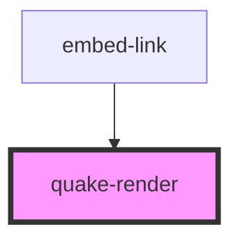

# my-component

<!-- Auto Generated Below -->

## Properties

| Property   | Attribute   | Description | Type      | Default |
| ---------- | ----------- | ----------- | --------- | ------- |
| `content`  | `content`   |             | `string`  | `''`    |
| `hasEmbed` | `has-embed` |             | `boolean` | `false` |

## Events

| Event            | Description | Type                |
| ---------------- | ----------- | ------------------- |
| `clickEmbedLink` |             | `CustomEvent<Link>` |
| `clickPageLink`  |             | `CustomEvent<Link>` |

## Dependencies

### Used by

 - [embed-link](../embed-link)

### Graph

----------------------------------------------

*Built with [StencilJS](https://stenciljs.com/)*
